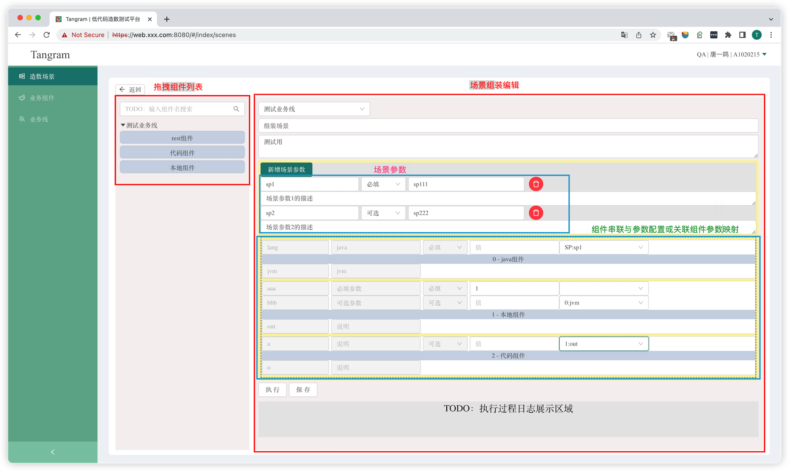

# 组件拖拽式低代码造数/自动化接口测试平台

> 个人实验项目，只进行核心功能的基础实现，欢迎大家提pr进行优化和共建。使得平台更完善。

## 整体架构

## 平台目标
全业务线的代码复用；
造数与自动化代码的复用；
屏蔽上下游业务，只关心好自己的业务组件即可；
一站式的自动化与造数平台；

## 组件类别
支持：
- 项目工程本地组件
- 外部Restful组件（POST）
- Java代码组件

## 组件规范
### 提供Post调用方式的Restful接口
统一封装为http接口作为组件
### 使用application/json格式进行传参
统一为Json传参进行请求
### 入参与出参类型为Map<String,?>（Java）或 Dict（python）
键为字符串类型，值随意
### 组件更新时出入参尽量只增不减，做到向后兼容
防止已经被场景使用的参数发生变化
### 路径
本地组件或代码组件均放置在`com/tangym/tangram/component`包下

## Java 代码组件
遵循规范编写的Class类，直接复制粘贴到平台上，由服务端编译加载，可动态更新，不打断执行引擎。

## 代码组件类加载隔离粒度
以业务线粒度，进行代码的组件及其依赖的隔离。

## 代码组件的Maven依赖管理与隔离
TODO

